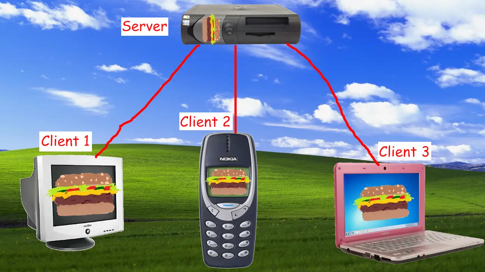

# Server and Client

Borger implements standard [_client-server architecture_](https://en.wikipedia.org/wiki/Client%E2%80%93server_model).

- This diagram represents 3 players with different devices who are in a shared multiplayer game session together.
- The red lines represent internet connections along which data is sent back and forth.
- You can see that clients don't talk to each other directly: all data flows through a central game server that everybody is connected to at the same time.
- All 4 devices, both server and clients, run the same [**simulation logic**](./simulation-and-presentation.md#simulation). Borger makes sure that the same code runs everywhere.

### Server

The _server_ exists to be the source of truth for all connected clients. Each game session has exactly 1 server.

- The server's [**state**](./io-state.md#output) is said to be _authoritative_: regardless of what each client sees, only the server's version of the game state is considered to be correct.
- When a client joins, it downloads the current game from the server.
- It continuously broadcasts small updates known as "diffs" (derived from differences) to client, as the state changes from tick to tick.

### Client

The term _client_ is used loosely to refer to a group of a few different things at once. Each individual client is:

1. A device
2. The connection between that device and the server
3. An instance of the game running on the device
4. The human who's playing said game

- The client's [**state**](./io-state.md#output) is said to be a _prediction_. Because of [**network latency**](../#the-problem), the client needs to try to predict what the server will send before the client receives anything.
- The most important thing to predict is the consequences of [**inputs**](./io-state.md#input). When the player tries to move their character, this should happen [**immediately**](./trade-offs.md#prediction) without waiting for the server's response.
- Classifying and treating the client's state as a prediction is what prevents certain forms of [**cheating**](./cheating.md). It's not real, so it can't hurt you!
- It continuously sends input events to the server: button presses, joysticks, etc. These inputs are the client's only means of impacting the game session.
- And of course, clients run [**presentation logic**](./simulation-and-presentation.md#presentation), unlike the server.
