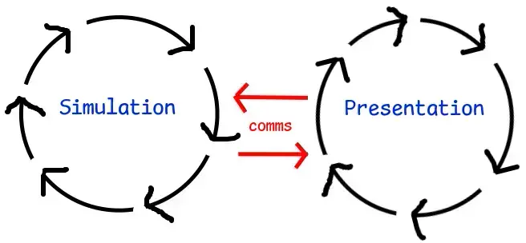

# Simulation and Presentation

All game code in a Borger project must be categorized as either simulation or presentation logic before writing anything.

- It's very difficult to pick incorrectly thanks to the language split: simulation is written in Rust, and presentation in TypeScript.
- Each type of logic is primarily driven by its own loop that fires at a specific interval. Each iteration of each loop is called a "tick".
  

### Simulation

The _simulation_ is the core game logic that runs on both the [**server**](./server-and-client.md#server) and [**client**](./server-and-client.md#client): enforcement of game rules, movement and collision, entity creation and removal, and other state changes/mutation.

- The tick rate of the simulation loop is a fixed 30Hz (iterations per second), or once every 33 milliseconds (derived by dividing 1000/30Hz).
- Each tick is assigned an incremental ID. When the server first launches, it starts at ID 0, then the next tick that happens 33ms later has ID 1, etc. When a [**client**](./server-and-client.md#client) joins, they start simulating at whichever ID the server is currently at and automatically stay in sync.
- Each tick ID may be resimulated multiple times due to [**rollback**](./rollback.md). Because of this, the code running in the loop must be [**deterministic**](./determinism.md) depending on the [**trade-off**](./trade-offs.md) used.

### Presentation

_Presentation_ asks the question: "How should the simulation be presented to the player?" It deals with rendering, UI, audio, and listening for [**input**](./io-state.md#input) events.

- The tick rate of the presentation loop is variable and tends to hover near (but practically never identical to) the player's display refresh rate. This is most commonly 60Hz (iterations/frames per second), or higher if they have disposable income.
- Presentation [**output state**](./io-state.md#output) state is read-only. It's meant to be read and, well, presented, as is.
- Crucially, presentation does not care _why_ the output is what it is. It blindly presents whatever the simulation tells it to.
- Although the presentation loop itself does not undergo [**rollback**](./rollback.md), it does have to be aware that the output it's receiving may have undergone rollback. Again, this is achieved by blindly trusting the simulation's output, even when it makes no sense due to [**mispredictions**](./misprediction.md): players teleporting, entities spawning and immediately despawning, etc.
- Presentation is [**client**](./server-and-client.md#client)-only. [**Servers**](./server-and-client.md#server) don't participate because they are generally [headless](https://en.wikipedia.org/wiki/Headless_computer) computers living in Big [Bezos warehouses](https://aws.amazon.com/), so "presenting" anything to the warehouse employees would be expensive and wasteful.
