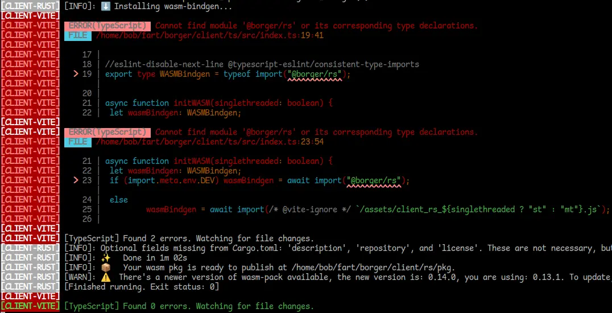
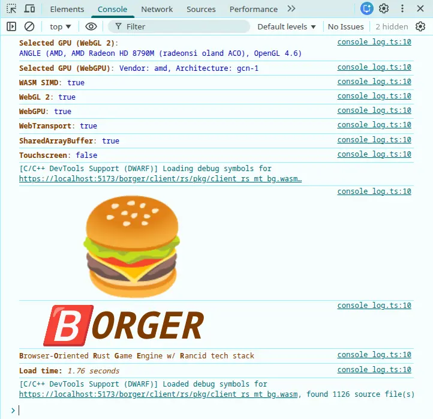
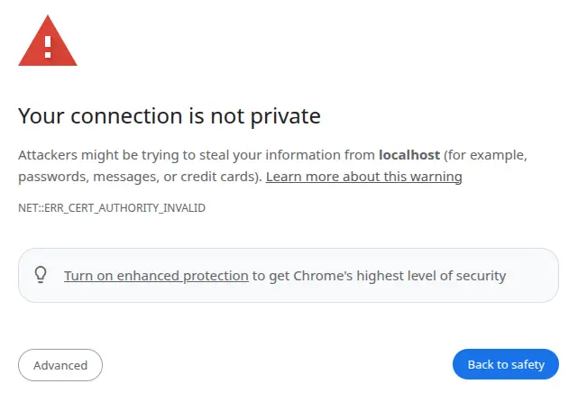

# Development Cycle

### Creating a New Project

Replace `my_game` with the name of the project folder to be created.

```bash
borger init my_game
cd my_game
borger dev
```

### Loading an Existing Project

```bash
git clone https://whatever/my_game.git
cd my_game
borger setup
borger dev
```

### Using `borger dev`

The `dev` command runs several parallel jobs:

- Automatically recompile each time you modify code
- Host a local game [**server**](../concepts/server-and-client.md#server)
- Host a local game [**client**](../concepts/server-and-client.md#client) web (HTTPS) server - specifically [Vite](https://vite.dev/), which supports hot reloading HTML, CSS, and sometimes even [graphics](https://r3f.docs.pmnd.rs/getting-started/introduction) without having to refresh the page or restart the game.

It can be tricky at first to decipher when `dev` is finished and it's safe to load the game. The golden rule is:

- The most recent output of `[SERVER-RUST]` is `it's alive.` The text is highlighted neon green and is hard to miss.
- AND
- The most recent output of `[CLIENT-RUST]` is `[Finished running. Exit status: 0]`
- The server usually finishes a few seconds before the client

Here's an example of a game that's ready to go:

Sometimes during compilation, you'll see the harmless error:

```
Cannot find module '@borger/rs' or its corresponding type declarations.
```


This can be safely ignored. For unknown reasons, the wasm-pack tool deletes the old WASM build before beginning, so for a few seconds during compilation, the module doesn't exist. As seen in the screenshot (`Found 0 errors` after it tries again), it corrects itself upon completion.

A few more helpful pointers:

- Visit <https://localhost:5173> in your browser to finally see the "game"! (A blank page by default)
- If you ever forget the URL, the Vite server reminds you:
  ```
  [CLIENT-VITE]   ➜  Local:   https://localhost:5173/
  ```
- Push F12 or Ctrl+Shift+I to open the DevTools console in order to verify the engine loaded successfully
  
- Push Ctrl+C in the terminal to close dev mode
- The dev server uses something called [self-signed certificates](https://en.wikipedia.org/wiki/Self-signed_certificate). If you've never worked with these before, you'll see a terrifying error the first time you try to test the game:
  

  In most cases, the browser is correct to scare you, but local web development is a notable exception. Choose `Advanced -> Proceed`. Essentially what's happened is the browser is unable to verify that this is a legitimate website, because it hasn't been deployed anywhere yet.

### Project Directory Structure

`/src/state.ts` - Declaration of [networked state](../api/state.md)  
`/src/presentation/index.ts` - [Presentation](../concepts/simulation-and-presentation.md#presentation) logic entry point (rendering, UI, audio)  
`/src/simulation/lib.rs` - [Simulation](../concepts/simulation-and-presentation.md#simulation) logic entry point (game logic)  
`/src/simulation/input.rs` - [Input](../concepts/input.md) handling callbacks  
`/index.html` - Main webpage, client entry point  
`/assets` - Art files loaded by the game  
`/borger` - [Source code of the framework](https://github.com/BorgerLand/Borger), linked via a [Git submodule](https://git-scm.com/book/en/v2/Git-Tools-Submodules)  
`/Cargo.toml` - Rust library dependencies  
`/package.json` - Java/TypeScript library dependencies  
`/rust-toolchain.toml` - Change which version of Nightly Rust to compile with  
`/vite.config.ts` - Install Vite plugins (such as [React](https://react.dev/)) for better hot reloading support

The rest can usually be ignored.
