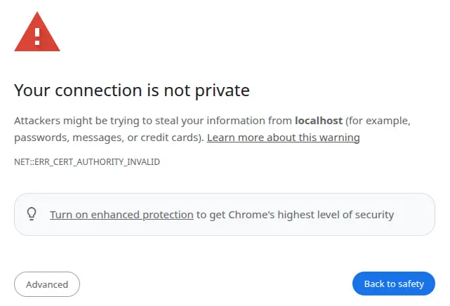
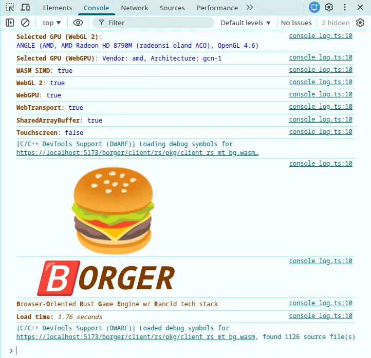
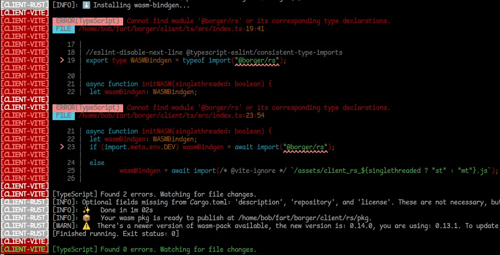

# Development Cycle

### Creating a New Project

Replace `my_game` with the name of the project folder to be created.

```bash
borger init my_game
cd my_game
borger dev
```

### Loading an Existing Project

```bash
git clone https://whatever/my_game.git
cd my_game
borger install
borger dev
```

### Using `borger dev`

The `dev` command runs several parallel jobs:

`RUN-CODEGEN`: Run code generator when [`state.ts`](../api/state.md) is changed
<br />
`TSC-CODEGEN`: TypeScript error detection on `state.ts`
<br />
`SERVER-RUST`: Watch and recompile the server
<br />
`CLIENT-RUST`: Watch and recompile the client's WASM binary
<br />
`CLIENT-VITE`: HTTPS development server - specifically [Vite](https://vite.dev/), which supports hot reloading HTML, CSS, and sometimes even [graphics](https://r3f.docs.pmnd.rs/getting-started/introduction) without having to refresh the page or restart the game.

The status bar pinned to the bottom of the logs lets you know when it's safe to visit the game client webpage. Due to Apple®, it is unknown how well the status bar behaves on macOS™. Here's an example of a game that's ready to go:

You can then Ctrl+Click the URL in the status bar to open it in your browser.

A few more helpful pointers:

- The dev server uses something called [self-signed certificates](https://en.wikipedia.org/wiki/Self-signed_certificate). If you've never worked with these before, you'll see a terrifying error the first time you try to test the game:
  

  In most cases, the browser is correct to scare you, but local web development is a notable exception. Essentially what's happened is the browser is unable to verify that this is a legitimate website, because it hasn't been [deployed](http://localhost:3000/development-cycle/deployment.html) anywhere yet. Choose `Advanced -> Proceed`.

- Push F12 or Ctrl+Shift+I to open the DevTools console in order to verify the engine loaded successfully
  
- Sometimes during compilation, you'll see the harmless error:

  ```
  Cannot find module '@borger/rs' or its corresponding type declarations.
  ```

  
  This can be safely ignored. For unknown reasons, the wasm-pack tool deletes the old WASM build before beginning, so for a few seconds during compilation, the module doesn't exist. As seen in the screenshot (`Found 0 errors` after it tries again), it corrects itself upon completion.

- Push Ctrl+C in the terminal to close dev mode

### Project Directory Structure

`/src/state.ts` - Declaration of [networked state](../api/state.md)
`/src/simulation/lib.rs` - [Simulation](../concepts/simulation-and-presentation.md#simulation) logic entry point (game logic)
`/src/simulation/input.rs` - [Input](../concepts/io-state.md#input) handling callbacks
`/src/presentation/index.ts` - [Presentation](../concepts/simulation-and-presentation.md#presentation) logic entry point (rendering, UI, audio)
`/index.html` - Game's main webpage, client entry point
`/assets` - Art files loaded by the game
`/borger` - [Source code of the framework](https://github.com/BorgerLand/Borger), linked via a [Git submodule](https://git-scm.com/book/en/v2/Git-Tools-Submodules)
`/Cargo.toml` - Rust library dependencies
`/package.json` - Java/TypeScript library dependencies
