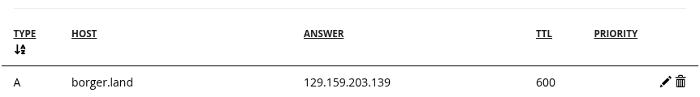

# Deployment

### Release build

```bash
borger release --build
```

This produces a `release` folder containing:

- `/release/server` - The final native executable, compiled to run on your OS
- `/release/client` - The static webpage, which can be hosted with any HTTP server capable of serving files

### Hosting

Deployment is a bit of a manual procedure at the moment due to requirements that Borger isn't able to provide for free:

- A domain name (TLS certificate providers typically refuse to generate certificates for a raw IP address)
- At least one always-on dedicated server. Pros with a high concurrent user (CCU) count typically have multiple across different regions of the world to handle demand.

If enough demand is shown, a paid service will be introduced in order to automate this process. For now, server orchestration is outside the scope of the problems Borger aims to solve.

The simplest, cheapest possible procedure for a small friend group looks something like this. It's not recommended for any significant amount of CCU, so this guide won't go into great detail.

1. Acquire a domain name. If you don't mind using a subdomain, check out [Duck DNS](https://www.duckdns.org/faqs.jsp).
2. Acquire a server. You could either self-host on your own hardware at home (keep in mind that home IP addresses often change), or rent from a cloud provider. [Oracle Cloud](https://www.oracle.com/cloud/free/) has an "always free" tier for their bottom of the barrel servers.
3. Point the domain name at the server's IP address. Set TTL to 0 to make it propagate fast. For example:
   
4. [Port forwarding](https://en.wikipedia.org/wiki/Port_forwarding)

   | Protocol | Port | Service                    |
   | -------- | ---- | -------------------------- |
   | UDP      | 6969 | Game Server (WebTransport) |
   | TCP      | 6996 | Game Server (WebSocket)    |
   | TCP      | 80   | HTTP Server                |
   | TCP      | 443  | HTTPS Server               |

5. TLS Certificates can be obtained for free through a service called [Let's Encrypt](https://letsencrypt.org/), via a tool called [Certbot](https://certbot.eff.org/instructions)

6. Run the servers, on the server:

   ```bash
   borger release --run --fullchain /etc/letsencrypt/live/borger.land/fullchain.pem --privkey /etc/letsencrypt/live/borger.land/privkey.pem
   ```
